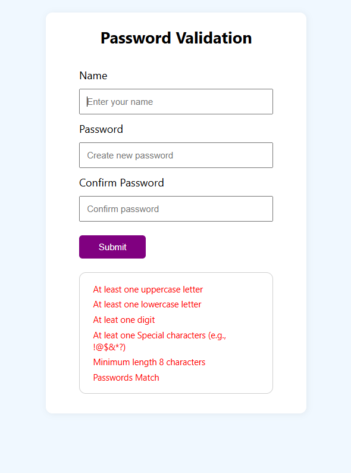

# Password-Validation Form 🔐



This is a simple React-based password validation form that checks for password strength using multiple criterias

- Minimum 8 characters  - At least one uppercase letter  - At least one lowercase letter  - At least one number  - At least one special character (!@#$%^&*)

---

## 📚 Background

This project was originally created as part of the **HENNGE Front-End Coding Challenge**.  
✅ I'm happy to share that I successfully completed and passed the challenge!

---
## Getting Started

To run this project locally:

```bash
git clone https://github.com/mominameen/password-validator.git
cd password-validator
npm install
npm start


